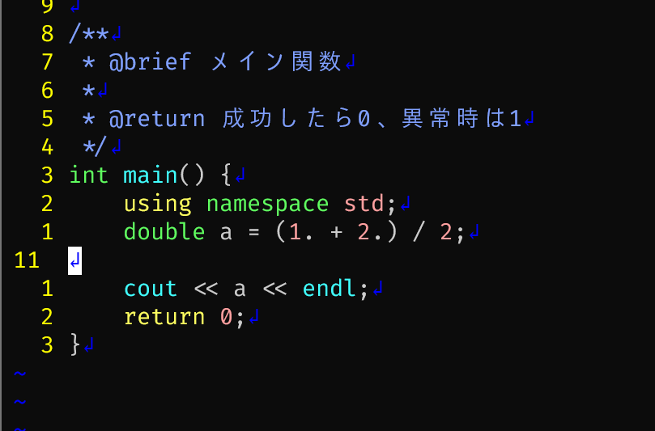

# dotfiles

## インストール方法

```bash
sudo apt install -y curl git wget build-essential
```

```bash
export CONFIG_USER_NAME=2lu3
export CONFIG_USER_EMAIL=hi2lu3@gmail.com
bash -c "$(curl -fsLS https://raw.githubusercontent.com/2lu3/dotfiles/main/init.sh)"
```

## アップデート方法

```bash
chezmoi update
```

## 使い方

`space, e`と書くと、スペースを押した後Eを押します。

`space+e`は、spaceを押しながらeを押します。

覚え方も記載していることが多いです。

### zsh

#### `direnv`

それぞれのディレクトリにある`.envrc`というファイルを自動で`source .envrc`する。

例えば、pythonの仮想環境をそのディレクトリに移動したときだけ立ち上げたい場合は、

```bash
cd /path/to/dir
python3 -m venv .venv
echo "source .venv/bin/activate" > .envrc
direnv allow
```

とすればよい。


#### ghq & peco

```bash
ghq get gitレポジトリのURL
```

とすると、`~/ghq`以下にgitレポジトリをcloneする。

`ctrl+]`でgetしたレポジトリ一覧が出現し、1つ選ぶと簡単にそのレポジトリまでcdできる。

この方法のメリットは、どこにgitレポジトリがあったかを覚えておく必要がない。

さらに、通常の`git clone`も使えます。

#### gpg

gnupg(gpg)がパスワードを暗号化して`~/.password-store`に保存してくれる。

gpgはsshの公開鍵のように、鍵を`~/.gnupg`以下に保存している。

そのため、`~/.password-store`と`~/.gnupg`以下は他の人に渡してはいけない。

#### 

### neovim

#### coc.vim

c++とかpythonとかの構文解析をして間違っているところを教えてくれたりする。

pythonを使うには、

```bash
pip install black
```

をする必要がある。

- `space,f,m,t`
  - 今開いているファイルをフォーマット
  - **f**or**m**a**t**
- `space,d,f`
  - 定義に移動
  - **d**e**f**inition
- `space,d,c`
  - 宣言に移動
  - **d**e**c**laration
- `space,r,n`
  - 変数などの宣言しているところで使うと、その変数などの名前を一括で変更できる
  - **r**e**n**ame

- `space,i,f`
  - その変数/関数/クラスの情報が表示される。
  - 宣言もしくは定義したときにコメントを書いていたら、そのコメントが表示される
  - **i**n**f**o

#### DoxygenToolKit.vim

c++のdoxygenというフォーマットに従ってコメントを書けます。



- `space,d,o,x`
  - 関数や変数の上にカーソルを合わせて、上のようにすると、上の写真のようにコメントができる
  - **dox**ygen

#### fern.vim

`space, E`で左側にファイルツリーを表示できます。


- `j`,`k` - 上下に移動
- `l`- フォルダを開く、`h` - フォルダを閉じる
- `N` - 新しいファイルを作成
- `K` - 新しいディレクトリを作成
- `R` - ディレクトリの名前を変更する

#### fzf-preview


こんな感じでファイルを検索できます

- `space, f, p`
  - ファイル名で検索
  - **f**zf **p**reviewです
- `space, f, g`
  - ファイルの内容を検索
  - **f**zf **g**rep
    - echo ファイル名 | grep 探したい文字列
    - でファイルの中のテキストから文字列を抽出できるのでそれにちなんでgrepという名前です

#### vim-pydocstring

docstringという形式のコメントを作れる。


- `space,d,o,c`
  - 関数の上にカーソルを当てて、上のようにすると、
  - **doc**stringなので

#### vim-quickrun

neovimの中からc++やpythonなどを実行できる


- `space,r,u,n`
  - 今選んでいるファイルを実行する
  - **run**


#### winresizer

画面を分割しているときに、大きさを変えることができる。


- `space,r`
  - 画面の大きさを変えられるモードになる
  - `hjkl`で大きさを変えて、`Enter`で永続化
  - **r**esize

## フォルダ構成

## ファイル構成

## TODO

- dockerのセットアップ

- tmux

```
UNATTACHED_LIST=$(tmux ls | grep -v attached | head -n 1)
UNATTACHED_ID=${UNATTACHED_LIST%%:*}

if [ -n "$UNATTACHED_ID" ]; then
    tmux a -t $UNATTACHED_ID
else
    tmux
fi
```
